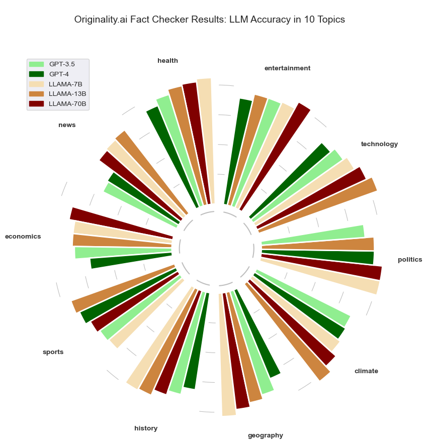

# Overview

A dataset of 5000 claims from 5 Large Language Models was processed by [Originality.ai](https://originality.ai/) Fact Checker.

## Data

1000 prompts from 10 broad topic categories was passed through the GPT-3.5, GPT-4, LLAMA-7B, LLAMA-13B and LLAMA-70B to generate claims. These claims were then processed through Originality.ai's Fact Checker which generated scores of `True`, `False` or `NAN` in situations where the LLM refused to generate a claim.

## Key Findings

- Average Model Accuracy across topics: 67.9% (LLAMA-13) to 76.9% (GPT-4)
- Average topic accuracy across models: Health (80.5%) to News (64.4%).
- 100% Prompt Confidence for LLAMA models. and 97% Confidence for the GPT models.

#### Disclaimer

The [Originality.ai](https://originality.ai/) Fact Checking tool is an aid to support editors to more efficiently fact check claims. and it is up to the end-user to interpret the results appropriately. It will sometimes provide inaccurate responses. This can include the data used in this study.
